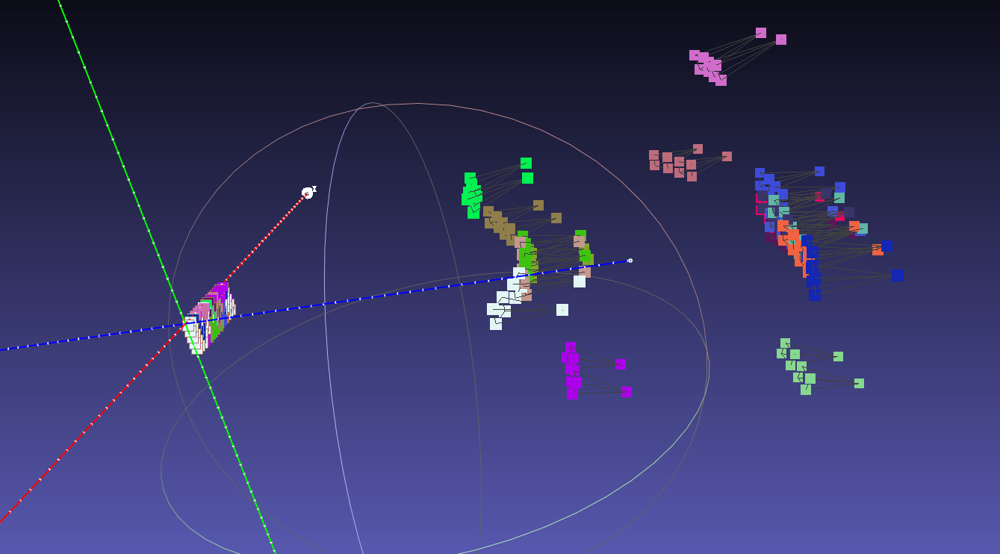
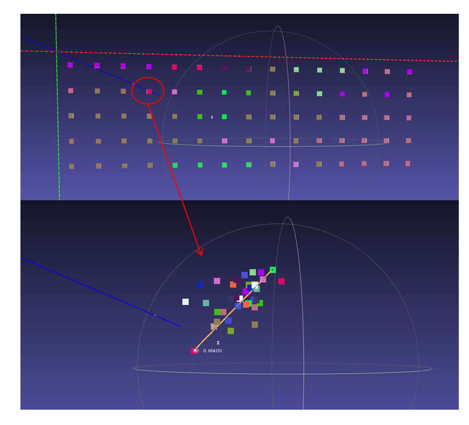

<h1 align=center font-weight:100>CSC-3DCV</h1>

In today's digital age, vision systems are gradually becoming a core technology in many fields.
To meet the demand for high-precision vision, I am developing a vision system based on a multi-camera model.
This system, through the collaborative work of multiple lenses, can provide high-precision visual data, which is suitable for downstream tasks such as 3D reconstruction and augmented reality(AR)engines.
Currently, the system has completed the calibration of a binocular pinhole camera with a precision of 1 millimeter, and more camera models and feature extraction algorithms will be added in the future.

  

  

## TODO
- [ ] Add multiple Aruco marker detection
- [ ] Add superPoint feature extracting
- [ ] Add Structured-Light unwrapping

# Licences

**CSC-3DCV** is distributed under the terms of MIT License. See [LICENSE](LICENSE) for details.